<div align="center">


# dma-bmi-bot

Make your university life easier with this Telegram bot!


</div>


# What can this bot do?

## Skip-tracking features
  - get skips of one user
  
    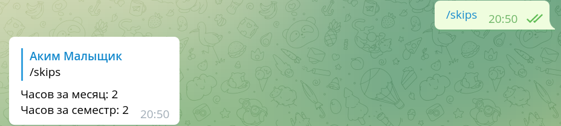
  - get skips of all users
  
    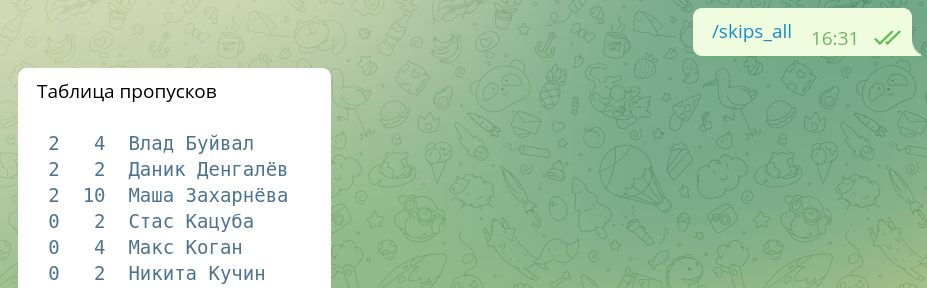
  - _(admin only)_ set skips of one user
  
    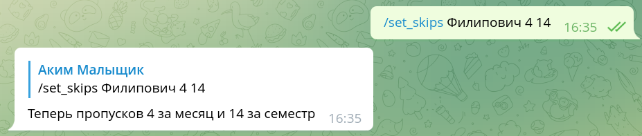
  - _(admin only)_ increment skips for many users (by last names)
  
    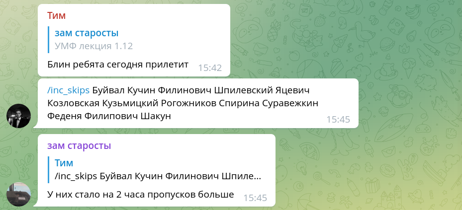
## Poll features
  - tag users who didn't vote
  
    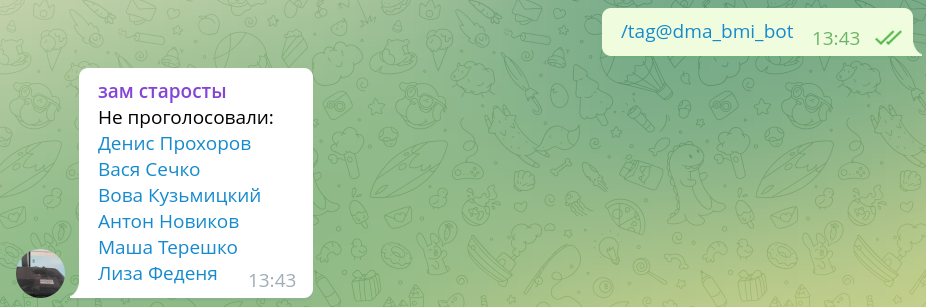
  - print poll stats (`/stats` command)
  
  - order voters by last name (built-in for all commands)
  
  - _(admin only)_ create polls 

    > just send poll to bot: it will create a copy of poll, send it to group chat and pin it
    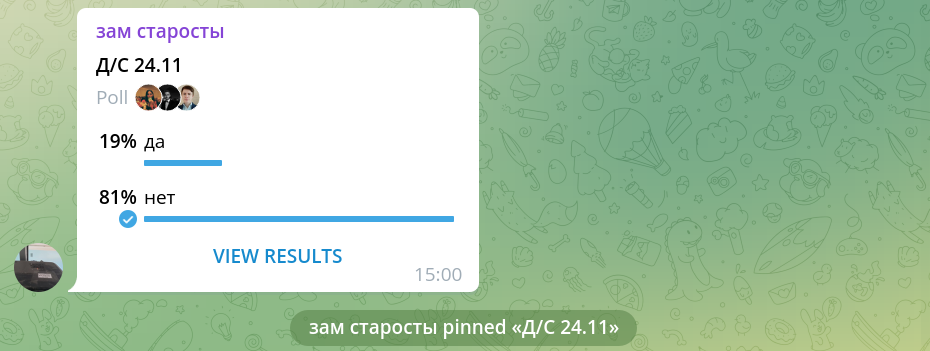
  - _(akim only)_ create schedule and send polls every week automatically

## Timetable features
  - print university timetable depending on department of user who made a request
  
    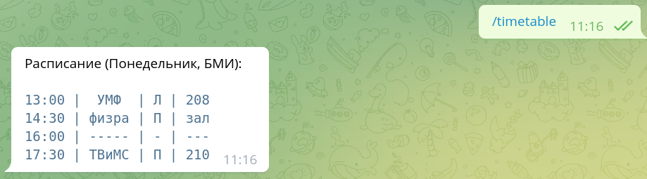
## Greeting features
  - send congrats for user in his birthday
  
    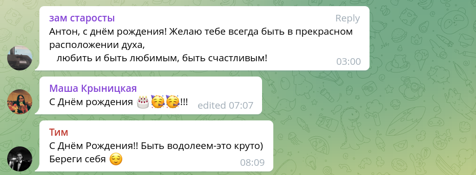
## Queue features
  - get queues list
  
    
  - get users list in queue
  
    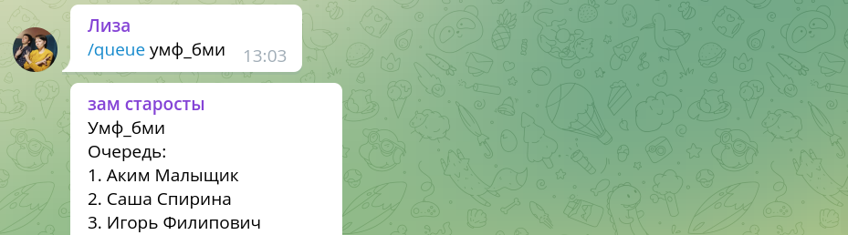
  - sign-up to queue
  
    
  - sign-up to particular place in queue (if it's free)
  
    
  - change position in queue
  
    
  - leave queue
  
    
  - leave queue and decrement queue positions
  
    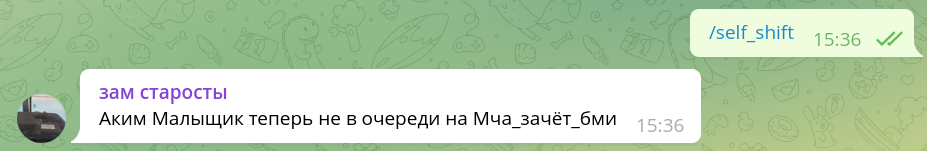
  - _(admin only)_ add queue
  
    
  - _(admin only)_ clear queue
  
    
  - _(admin only)_ remove queue
  
    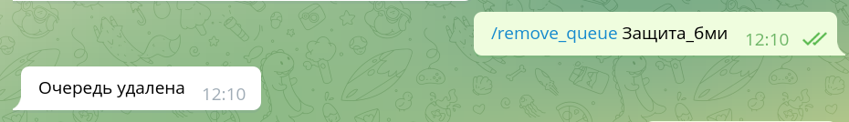
  - _(admin only)_ kick first user from queue and shift
  
    


# How to test the bot locally?
1. Install PostgreSQL: https://www.postgresql.org/download/.
2. Create user `postgres` with password `postgres` (to use other credentials, edit `settings.py`).
3. Create `dma_bmi_test` database with `public` schema in it.
4. Run the following script:

  ```sql
create sequence queue_id_seq
    as integer;

create sequence user_queue_id_seq
    as integer;

create sequence poll_option_id_seq
    as integer;

create sequence user_vote_id_seq
    as integer;

create table departments
(
    id      integer not null
        constraint department_pk
            primary key,
    chat_id integer,
    name    text


);


create table polls
(
    id            char(50) not null
        constraint poll_pk
            primary key,
    department_id integer
        constraint poll_department_id_fk
            references departments
            on update cascade on delete cascade,
    question      text,
    created_at    timestamp
);

create table users
(
    id             integer not null
        constraint user_pk
            primary key,

    first_name     text,
    last_name      varchar(20),
    department_id  integer
        constraint user_department_id_fk
            references departments
            on update cascade on delete cascade,
    sub_department char(3),
    is_admin       smallint,
    skips_month    integer,
    skips_semester integer,
    birthday       timestamp
);

create unique index user_last_name_uindex
    on users (last_name);

create table queues
(
    id            integer default nextval('queue_id_seq'::regclass) not null
        constraint queue_pk
            primary key,
    department_id integer
        constraint queue_department_id_fk
            references departments
            on update cascade on delete cascade,
    name          text,
    is_last       smallint
);

alter sequence queue_id_seq owned by queues.id;

create table scheduled_polls
(
    id            integer not null
        constraint poll_schedule_pk
            primary key,
    department_id integer
        constraint poll_schedule_department_id_fk
            references departments
            on update cascade on delete cascade,
    question      text,
    is_multi      smallint,
    weekday       char(9),
    utc_time      timestamp
);

create table poll_options
(
    id      integer default nextval('poll_option_id_seq'::regclass) not null
        constraint poll_option_pk
            primary key,
    poll_id char(50)
        constraint poll_option_poll_id_fk
            references polls
            on update cascade on delete cascade,
    text    text
);

alter sequence poll_option_id_seq owned by poll_options.id;

create table queue_positions
(
    id       integer default nextval('user_queue_id_seq'::regclass) not null
        constraint user_queue_pk
            primary key,
    user_id  integer
        constraint user_queue_user_id_fk
            references users
            on update cascade on delete cascade,
    queue_id integer
        constraint user_queue_queue_id_fk
            references queues
            on update cascade on delete cascade,
    position integer
);

alter sequence user_queue_id_seq owned by queue_positions.id;

create table users_poll_options
(
    id        integer default nextval('user_vote_id_seq'::regclass) not null
        constraint user_vote_pk
            primary key,
    user_id   integer
        constraint user_vote_user_id_fk
            references users
            on update cascade on delete cascade,
    option_id integer
        constraint user_vote_poll_option_id_fk
            references poll_options
            on update cascade on delete cascade
);

alter sequence user_vote_id_seq owned by users_poll_options.id;

create table timetables
(
    id             serial
        constraint timetables_pk
            primary key,
    department_id  integer
        constraint timetables_departments_id_fk
            references departments
            on update cascade on delete cascade,
    sub_department varchar(255) default NULL::character varying,
    weekday        varchar(255),
    start_time     time,
    subject        varchar(255),
    auditory       varchar(255),
    type           char
);
  ```

5. Fill database with some test data. 
> We recommend adding your Telegram id to `departments` table in `chat_id` field. 
This allows you to test all commands within your own bot chat.
6. Run the following command
  
  ```bash
  python __main__.py
  ```
  > By default, script uses https://t.me/famcs_timetable_bot for tests, 
but you can change bot token in `settings.py` and use your own bot. 
7. Press `start` in bot chat and enjoy!

